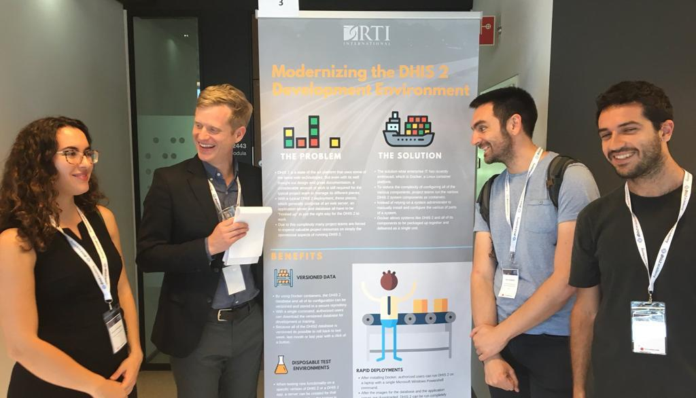

This year I attended the annual DHIS2 conference in Oslo, Norway. Here are five things that I learned there.

# 1. DHIS 2 is a worldwide effort

This year was the 7th Annual DHIS 2 conference held at the University of Oslo (UiO) in Norway with over 260 participants from 60 countries gathered. I was there representing RTI, but so was too was Clinton Health Access Initiative (CHAI), Intrahealth, Jhpiego,  International Rescue Committee (IRC), DAI, UNICEF, GAVI, Planned Parenthood, and Federal Ministry of Health from Ethiopia, Gambia, and Palestine among others. With over 12 million dollars received in funding last year, the UiO has been able to recruit the top talent health informatics, software development and database management. 

# 2. There is a vibrant DHIS 2 app developer community

To extend the functionality of the core platform, DHIS 2, supports something called a DHIS 2 app. Just like the apps for your phone or tablet, these apps are individual programs that can be run on top of the core platform. There is even a DHIS 2 App Store where you can search for and download various DHIS 2 apps. Some examples of this are an app from the WHO called The WHO Data Quality Tool, an app from HISP Uganda called the Metadata Repository for managing the overall database configuration, and another from HISP Tanzania called the Scorecard Dashboard Widget for displaying scorecards. 

What are HISP Tanzania and HISP Uganda you ask?  Well, that's another thing. HISP organizations or Health Information System Providers are regional centers of health informatics practitioners supported by the University of Oslo.

# 3. This year the conference hosted a DHIS 2 app contest (and the apps that won are really cool)

Something new to this year's conference was the app developer competition. The way that this worked was all of the finalists had five minutes to present their apps in one of the  plenary sessions, then the conference participants voted using Kahoot (check it out for your next event, its cool). This was a pretty popular part of the conference, so I imagine that this will be around for a while. Here were the winners:

* **[Data Import Wizard App](https://github.com/HISP-Uganda/dhis2-data-importer), HISP Uganda**  This was the ultimate winner. Anyone who has worked with DHIS 2 knows that even with the various ways of loading data into the system, it can still be a challenging and tedious process. That's where the Data Import Wizard app comes in. With this app, you can define the structure of your data file (this is usually excel), specifying the columns and their mappings to the existing DHIS 2 data elements. 
* **Services Management App, Alfredo Muchanga** Currently in the DHIS 2 user interface, it can be difficult to know exactly what health facilities provide what service. Currently, this is relatively easy to configure - you just assign a dataset to whatever organization unit you want, but to see this on a national level is not possible. Unit now that is. The Services Management App reads all of the dataset to organization unit associations and provides a single view. Slick.
* **[Smart Display App](https://github.com/HISP-Uganda/dhis2-smart-display), HISP Uganda** This one was my favorite. All this app does is display dashboards in full screen mode. The idea here is that a monitor is installed in the board room, somewhere in the MoH, by the water cooler, wherever and this app is then used to display those dashboards. The point, of course, is to promote the use of all of the wonderful data that has been collected and there is no better way to do this than to put these maps, charts, and other visualizations out there in the physical world for all to see.

# 4. The WHO has partnered with the University of Oslo to produce DHIS2 configuration packages

You can read more about it [here](https://www.who.int/healthinfo/tools_data_analysis_routine_facility/en/), but the WHO recently published the Analysis and use of health facility data toolkit which is set of resources to optimize the analysis and use of data collected through routine health facility information systems, (HMIS).  Program specific analysis for this toolkit is provided for HIV, Malaria, Immunization, TB, and other programs areas are under development. One of the resources provided with this toolkit are disease specific configuration packages, which are a core set of indicators and dashboards that can be imported directly into DHIS 2. So with these configuration packages implementers have a starting point from which to build out their DHIS 2 database, all based on WHO recommendations.

# 5. DHIS 2 is expanding beyond health

While DHIS 2 was originally designed to manage district level health data (heck, health is one of the words in the acronym District Health Information System) because it is a flexible system, there is no real reason why DHIS 2 cannot or should not be used by other sectors as well. This is exactly what Alpha Bah, the head of Education Management and Information System (EMIS) and ICT Units, Planning Directorate in Gambia is doing. There, Alpha and his team are using DHIS 2 to track students, teachers and their performance, effectively turning DHIS 2 into a EMIS or Education Management Information System. There are also other examples of using DHIS 2 to manage WASH data. Let me be the first to say that DHIS 2 is not a silver bullet data management solution, but sessions at this conference have taught me that this platform is highly flexible and can be adapted to sectors outside of health.