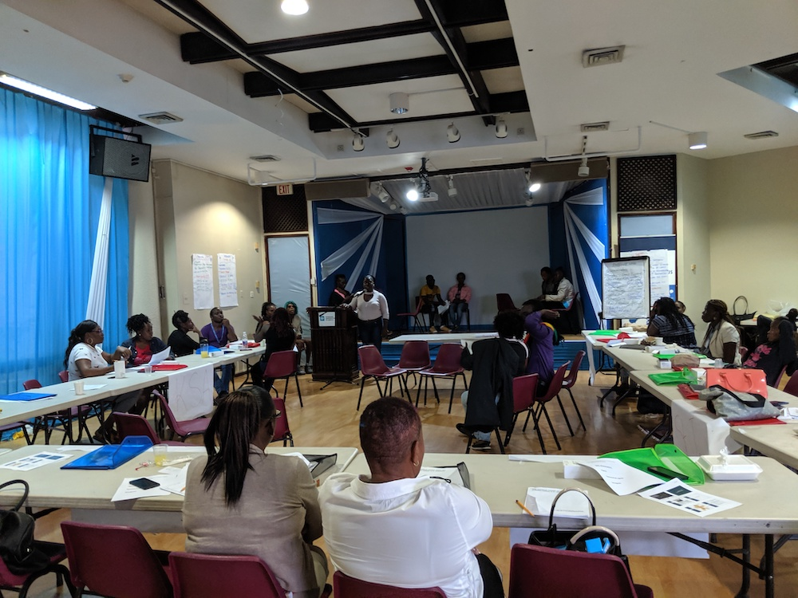

In the world of public health one of the fundamental priorities is ensuring that everyone has access to healthcare. The World Health Organization uses the term UHC or <a href="https://www.who.int/health-topics/universal-health-coverage#tab=tab_1s" target="_blank">Universal Health Coverage</a> for this concept. There are a lot reasons why people do not have access health care and one of them, especially in HIV community because of discrimination. UNAIDS and the World Health Organization (WHO) cites fear of stigma and discrimination as the main reason why people are reluctant to get tested, disclose their HIV status and take the required medication.

 Over the five days, this room of people were trained to conduct the HIV Stigma Index for Jamaica.

# The HIV Stigma Index

Jamaica just wrapped up a national survey to assess the burden people living with HIV (PLHIV) face in their daily lives. This survey is called the <a href="https://www.gnpplus.net/our-solutions/hiv-stigma-index-2/" target="_blank">PLHIV Stigma Index</a>. In coordination with Health Policy Plus, a PEPFAR supported program and the GNP +, the Global Network of People living with HIV, this study aims to understand the ways in which people living with HIV are affected by stigma and discrimination. Since the project began in 2008, it has been implemented in over 100 countries. More than 230 people living with HIV have been trained as interviewers and over 100,000 people living with HIV have been interviewed. The Stigma Index is a joint program of GNP+, the International Community of Women living with HIV (ICW) and The Joint United Nations Program on HIV/AIDS (UNAIDS). 

One really interesting facet of the HIV Stigma Index is that its social research project implemented by people living with HIV themselves. Building an evidence base is the objective of any research study, but building capacity and increasing advocacy within the study's population something truly unique.

# Here's what we did
As a research organization, RTI does a lot of international survey research. In conducting this research its common to subcontract out some of this work to partner research firms to conduct the interviews and physically collect the data. For the HIV Stigma Index in Jamaica we partnered with a local research firm called Market Research Services Limited who was responsible for, among other things, recruiting and hiring the interviewers.  To train these interviewers on the study, I traveled to in Kingston, Jamaica with esteemed HIV Stigma Researcher, Laura Nyblade to conduct a workshop. My role was to work with our partner research firm and the future interviewers in using the technology for conducting the interviews.

Following the workshop, the interviewers were deployed throughout the country to do their part in this research study. The report is being written now and once its published you can find it on the <a href="https://www.stigmaindex.org/country-reports/" target="_blank">Stigma Index website</a>.

# Conclusion

Understanding the barriers to the HIV treatment, prevention, care and support is so important because with the proper access to healthcare people living with HIV are able to living healthy and fulfilling lives.  Stigma an discrimination are unfortunate in any form but by understanding when and where this is occurring in a community, the appropriate interventions can carried out. Want to earn more? Get the latest from the GNP+ community <a href="https://www.gnpplus.net/category/news/" target="_blank">here</a>. 
