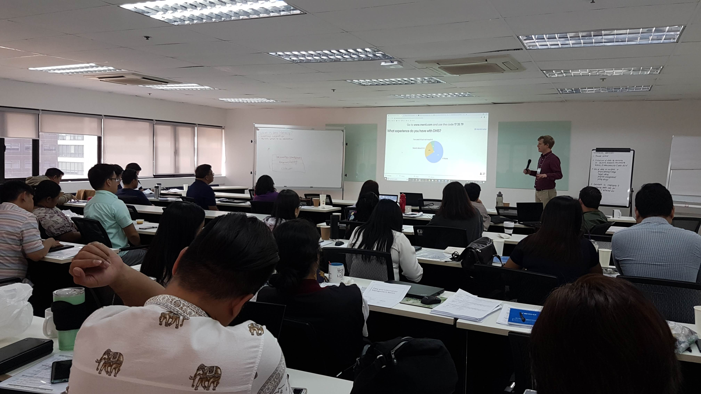

ReachHealth is a USAID supported program that provides support to the Philippines Department of Health (DOH) to address unmet family planning across the country. One of the central activities on this project is to monitor the family planning services provided at health facilities in the supported regions.  In all, the project monitors these services across roughly 2100 clinics and hospitals. This information is collected using a standard form of roughly 80 questions such as: "is this a birthing facility?", "does your facility provide male condoms?" and "has your facility run out of IUDs in the past quarter?" In addition, there is government routine surveillance system of these facilities called the Field Health Services Information System (FHSIS) which captures other information. So, needless to say there is a lot to keep track of to get a full picture of the available family planning services across the country. 

Initially, project data were collected using a paper form and then encoded to Microsoft Excel and then ultimately consolidated to provide the project level reporting. Even with a team of Microsoft Excel wizards (which this project has), this was not a tenable process. What ReachHealth needed was a more efficient way to collect and analyze their project data. To accomplish this, the project turned to the popular open source platform DHIS2 or District Health Information System, an open source platform that has emerged as the standard in national health information systems.

 Over 2.5 days this group of M&E specialists and other interested project staff participated in Data Utilization workshop where we covered everything from fundamentals in data analysis to building data visualizations. 

## Here's what we did

This past December, I was at the ReachHealth office in Manila planning the implementation of DHIS2 as the project's information system and conducting training. While this training mainly focused on the fundamentals of DHIS2, we also spent time in a broader discussion of how to increase the utilization of their data. In other words, once efficiencies are gained through digitizing monitoring and evaluation (M&E) processes, how can the project team best utilize this investment. 

 The term *Data Literacy* is thrown around a lot these days, but the concept is an important one on global health projects. Once an investment is made in an information system, investing in the users of the system to understand the data is the next step (or the same step depending on how you look at it). After all of the tools and technology, it really comes the individual's ability to use the data for decision making. So data literacy is a broad term for how well users of the information system are able to understand and ultimately use their data.
 
To address data literacy in this training we leveraged the [Data Playbook Beta project](https://www.preparecenter.org/toolkit/data-playbook-toolkit). The Data Playbook, which is a prototype of social learning designed on modularized pick-and-choose model, was initially designed by the International Federation of the Red Cross (IFRC) to promote on their projects. Playbooks are designed to be guided by the users and leaders to decide what 'activity' or 'action' best suits the given need. We incorporated several playbooks throughout the training such as Module 1: Data Essentials, Module 2: Data Culture, and Module 4: Responsible Data Use.
 
In early 2020, the ReachHealth M&E team replicated this training for two other other regions, Mindanao and Visayas. Soon the project will be collecting site level electronically and pulling in FHSIS data to a central data repository enabling the project to analyze and interpret their project data in real time. 

## Conclusion

Deploying technology infrastructure is only the first step in digitizing M&E processes. DHIS2 provides a great foundation for data management and reporting but to fully realize the investment of digital M&E, project teams should also have a foundation of data literacy. Having the technology infrastructure in place along with users who are equipped to understand and interpret data is how we're building a culture of data use to support family planning in the Philippines. 
