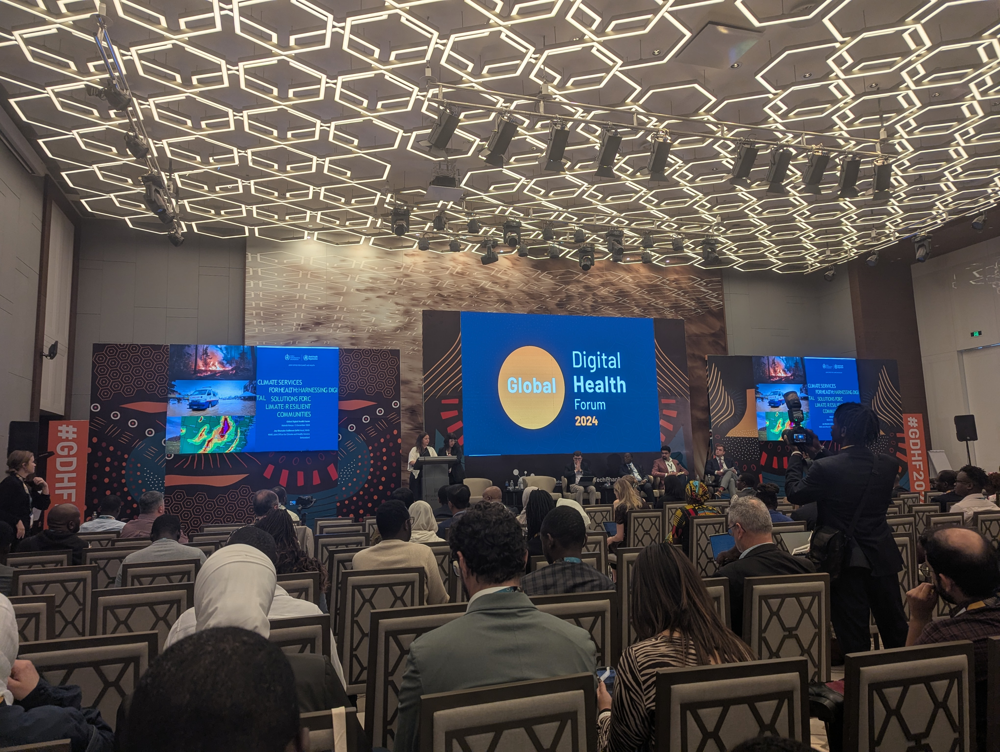

This year I attended the Global Digital Health Forum in Nairobi, Kenya. Here are a few things that I learned there.

## Digital Public Infrastructure (DPI) is a new way to think about digital development
DPI refers to a set of digital systems, platforms, and services that are publicly accessible and foundational for societal and economic development. USAID is really promoting this concept.  Adele Waugaman, Senior Digital Health Advisor USAID Bureau for Global Health presented on DPI at this conference and this concept is also  featured in  USAIDs new Digital Position Paper (2024-2029). 

## Digital tools have a major role to play at the intersection of climate and health
There were 10 presentations on how digital tools at national, regional, and global levels can and should be better utilized to incorporate climate data. Digital Square at PATH was well represented in these conversations where they discussed  climate-informed health system strengthening and previewed the Global Goods Guidebook for Climate and Health. University of Oslo is board too as they presented the newly released DHIS2 Climate Data App, a web-based application that facilitates the integration of climate and health data in DHIS2 to facilitate combined analysis and visualization of climate-related health impacts, thus supporting climate-resilient health systems through more effective planning and response.

## System interoperability is foundational to a well functioning HIS
There was a significant focus on interoperability at the conference, and for good reason.  According to Taufiq Sitompul the CHISU Senior technical advisor there are around 600 digital systems in use within the Health Information System in Indonesia. For these systems to communicate there needs to be standards. One popular standard is FHIR (Fast Healthcare Interoperability Resources)  which  is designed to make it easier to share data between different healthcare systems in a standardized and interoperable way. FHIR is such a big deal to Matt Berg founder of Ona Systems, that OpenSRP, their flagship platform for frontline health workers, was completely rewritten last year from the ground up to natively support it.
